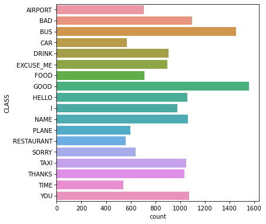
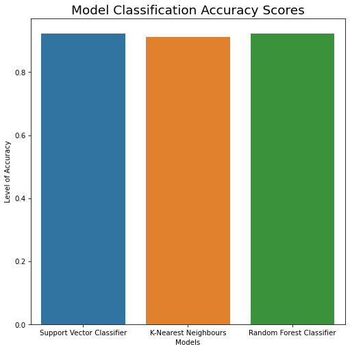
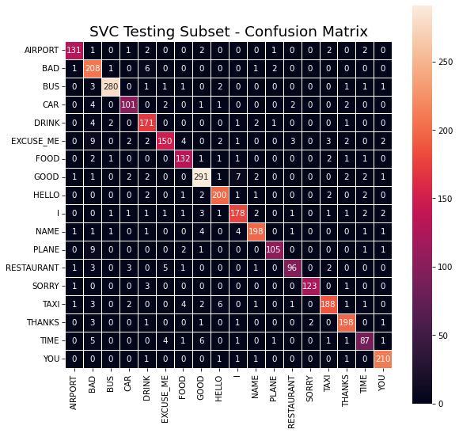

# British Sign Language Multi-Class Classification - Gaussian Naïve Bayes, Support Vector Classifier (SVC), K-Nearest Neighbours & Random Forest Classification - Machine Learning - MSc. Computer Science - January/May 2021

This machine learning experiment was developed and tested with a dataset that was publicly obtained through Kaggle and was used as part of a study by Bird, J.J., Ekárt, A. and Faria, D.R. (2020). Within this dataset are classes (signed words)that correspond to hand gesture data (x, y and z sensor data taken from the gesture that the person is making). From this data, the intention of this experimental assignment was to determine the best classification model that could accurately predict what signed word is being made based on the hand positional data. This dataset contained a total of 18 words that are labeled as such:

### Number of unique target classes in the dataset

Using the Anaconda libraries Pandas, Numpy, MatPlotlib, Seaborn and SciKit Learn, the data had been appropriately cleaned and formatted into training and testing subsets. Each subset was processed through Principal Compontent Analysis (PCA) to reduce the dimensionality of the dataset before classification and data visualisation.

The processed data was then appropriately trained through each of the four different classification models that SciKit Learn provides. While three of the chosen models worked well with the given dataset, the Gaussian Naïve Bayes model did not work well with the processed dataset. This was due to the concept of 'Posterior probability’ that models like this, as well as Bernoulli and Multinominal Naïve Bayes, adopt and the assumptions it would make based on the features identified.

Cross-Validation was also adopted to ensure that the overall accuracy score was not effected by potential overfitting based on the training data passed to each model. Once Cross-Validation was complete and there were no clear signs of overfitting, each model was tested against the testing subset. The results from each of the four models were then visualised into Confusion Matrices, Barplots and Curveplots using the Seaborn library.

From this experiment, the overall accuracy for three of the four models chosen for this resulted in strong accuracy results. Despite the Gaussian Naïve Bayes model not working as intended, the other models proved more than sufficient in predicting what hand signs are being made based on the x, y, z coordinal positions of the hand and its features (pitch, yaw and roll of each finger on the hand).

### Results of Support Vector Classifier (SVC), K-Nearest Neighbours & Random Forest Multi-Classification

### Gaussian Naïve Bayes Confusion Matrix

### Support Vector Classifier (SVC) Confusion Matrix

### K-Nearest Neighbours Confusion Matrix

### Random Forest Confusion Matrix

### Sources:

* Bird, J.J., Ekárt, A. and Faria, D.R. (2020) 'British sign language recognition via late fusion of computer vision and leap motion with transfer learning to american sign language', Sensors (Basel, Switzerland), 20(18), pp. 1-19. doi: https://doi.org/10.3390/s20185151.

* Dataset - https://www.kaggle.com/datasets/birdy654/sign-language-recognition-leap-motion/data

